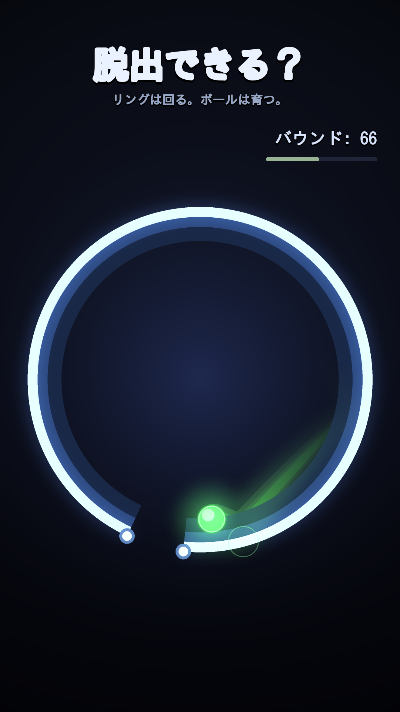

# ball-escape — TikTok向け「輪から脱出できる？」動画ジェネレータ

回転するリングの中でボールが跳ね、バウンドのたびに少しずつ大きく・速くなる。
リングには隙間が1つだけあり、そこから**脱出できるか**／出る前に**育ちすぎて閉じ込められるか**を見守る70秒の縦型動画を生成する。



## 使い方

```bash
pip install --break-system-packages pillow numpy   # ffmpeg も必要
python3 ball-escape/escape.py --preview            # 1フレームだけ ./output/preview.png に
python3 ball-escape/escape.py                      # 本番 → ./output/escape.mp4 (70秒)
```

よく使うオプション:

| オプション | 既定 | 意味 |
| --- | --- | --- |
| `--out` | `output/escape.mp4` | 出力先 |
| `--duration` | `70.0` | 尺（秒）。TikTokの収益化条件に合わせて60秒ちょうどにはしない |
| `--fps` | `60` | フレームレート |
| `--seed` | ランダム | 同じ結末を再現したいとき。実行ログに使われたシードが出る |
| `--render-seconds` | 全尺 | 短縮テスト用（冒頭N秒だけ描画） |
| `--preview` / `--preview-at` | – | 1フレームPNG（既定は14秒地点） |
| `--no-audio` | – | 音なしで書き出す |
| `--hold` | `1.0` | 最後の静止時間（ループしても違和感が出にくい） |

## しくみ

**物理** — 円の内壁に対するベクトル反射を自前実装（pymunkは使っていない）。
隙間の判定を「壁との接触角」で直接扱いたいのと、成長するボールの半径を
そのまま通過判定に使いたいため。

- バウンドごとに半径 ×`grow_r`、目標速度 ×`grow_v`（上限あり）
- 反射後は速度を目標速度に正規化するので、重力は軌道の曲がり方だけを決める
- 接線方向に微小ジッタを入れ、円内ビリヤードの準周期性を崩してリング全体を舐めさせる
- 隙間の角度範囲に対し `|接触角 - 隙間中心| + asin(r/R) <= 隙間半角` を満たせば通過＝脱出
- `r > R*sin(隙間半角)` になると物理的に二度と通れない＝閉じ込め確定

**尺のコントロール** — 素直に回すと数秒で脱出してしまい70秒もたない。
そこで毎回「脱出／閉じ込め」をコイントスで決め、**決着が終盤（既定56〜66.8秒）に来るシードだけを
ヘッドレスで探索**して採用している（1本あたり数百候補・1秒未満）。
シード探索なので物理には一切手を入れていない＝出目は本物。

**描画** — Pillow。2倍解像度(2160x3840)で描いてから `reduce(2)` で縮小しアンチエイリアス。
発光は1/4解像度のレイヤーをぼかして加算合成。トレイルはリングの奥、ボールは手前に合成。
育ったボールが当たった時だけ軽い画面シェイク。決着時は0.3倍速のスローモーション。

**音** — numpyでバウンド音（ペンタトニックで上昇するブリップ）と決着SEを合成してWAVに書き、
ffmpegで多重化。ピーク正規化ではなく固定ゲイン＋ソフトクリップなので、音数の多い回／少ない回で
音量が変わらない。

## 映えを上げたい時に触る場所

- `Renderer.RING_COL` / `Renderer._background()` … 配色。リングを暖色、背景を紫寄りにするだけで別物になる
- `Params.hue_step` … バウンドごとの色相の進み方
- `Visuals.TRAIL` と `_prims_back()` の3パス … トレイルの長さ・太さ・柔らかさ
- `_glow()` のぼかし半径と混色 … ブルームの強さ
- `Sim.timescale()` … 決着時のスローモーションの深さと長さ
